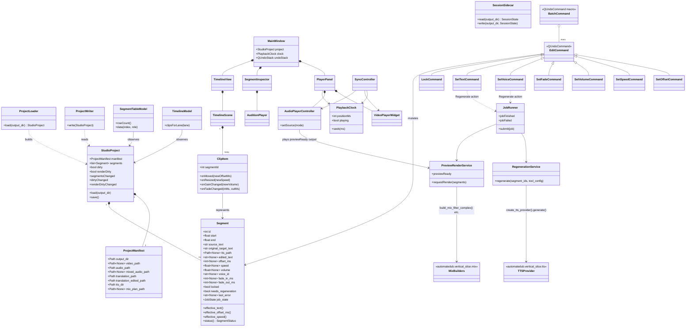

# VS5 — AutomateDub Studio: Architecture Design

Status: design only. No implementation. This document replaces the earlier
VS5 "Render Playable MP4" milestone description in `PROJECT_STATE.md` /
`docs/MILESTONES.md` as the definition of what VS5 now means; those files
are updated separately, not by this document.

This is a revision of the initial VS5 Studio design. The product direction
changed in two ways that ripple through the whole document:

1. **The Studio is not a general video editor.** It is a dedicated AI
   dubbing review/editing tool built on top of the existing pipeline —
   scoped to reviewing, timing, previewing, selectively regenerating, and
   exporting, not to arbitrary video editing (cuts, transitions, effects,
   multi-track video composition are all out of scope, permanently, not
   just "not yet").
2. **The Studio calls the backend in-process, not via CLI subprocess.**
   The earlier draft of this document routed every Studio action (regenerate,
   remix, export) through `subprocess`-invoking the `automatedub` console
   script. That is replaced: the Studio imports and calls the same Python
   library modules the CLI itself calls. The CLI and the Studio are two
   frontends over one backend.

## 1. Purpose And Scope

AutomateDub Studio opens an existing `output/` folder produced by the CLI
(VS0–VS4, complete and stable) and lets a human review and adjust the dub
before export. In scope for this document: folder structure, module
structure, MainWindow layout, timeline architecture, video/playback
architecture, data model, plus the class diagram, data flow, and a phased
delivery roadmap that fall out of those. Out of scope: any GUI code, any
PySide6 widget implementation, any change to the CLI.

## 2. Core Design Principle

> **Never regenerate unless the user explicitly requests it.**

The generated TTS WAV files in `tts/*.wav` are **working assets** — they
are expected to be overwritten by a user-triggered regeneration, unlike
`translation.json`, which is permanently read-only input. Editing in the
Studio happens in two clearly separated tiers, and every feature in §8
below is one or the other, never both:

| Tier | Fields | Cost | Trigger |
|---|---|---|---|
| **Metadata edit (local)** | `offset_ms`, `speed`, `volume`, `fade_in_ms`, `fade_out_ms`, `locked` | Free, instant, local FFmpeg only | Any drag/type/click in the timeline or inspector |
| **Content edit → regeneration required** | `edited_text`, `voice_id` | An API call to the TTS provider, real cost, real latency | Only an explicit **Regenerate** action |

This split is what makes "edit metadata first, regenerate later" possible:
`offset_ms`/`speed`/`volume`/`fade_in_ms`/`fade_out_ms` are **render-time
parameters** — the same category of thing `mix.py` already applies today
(`delay_ms`, `atempo`, `duck_volume`) — so they can be previewed and
committed by re-running local FFmpeg filters over the *existing* WAV,
with zero network calls. Changing `edited_text` or `voice_id` changes what
the synthesized speech itself sounds like, which only the TTS provider can
produce — so those two fields never take effect on their own; they only
flip `needs_regeneration = true` on the segment and wait for the user to
click a Regenerate action (§11). This distinction is the backbone of §7,
§10, and §11.

## 3. Boundary With The Backend

- The Studio imports `automatedub.config` and `automatedub.vertical_slice.*`
  directly, in-process. It calls `load_tool_config()`, `create_tts_provider()`,
  `TTSProvider.generate()`, `list_cambai_voices()`, and the pure filter-graph
  builder functions in `mix.py`, the same functions `automatedub/cli.py`
  calls. There is no `subprocess.run(["automatedub", ...])` anywhere in the
  Studio for normal operations (open project, edit, preview, regenerate,
  save). `cli.py` remains a thin argument-parsing layer over this same
  library code; the Studio is the second frontend over it.
- This is *not* the same claim as "the Studio never starts a subprocess."
  `mix.py`'s functions already shell out to `ffmpeg`/`ffprobe` as OS
  subprocesses — that's the backend's own local media-tool usage, unchanged
  and reused as-is. The rule is specifically: **no subprocess boundary
  between the Studio and the `automatedub` backend.** FFmpeg/FFprobe
  subprocesses invoked *by* that backend code are fine, and already exist.
- The Studio never writes into the CLI's own artifacts —
  `translation.json`, `mix_plan.json`, `mixed_audio.wav`, `audio.wav`,
  `transcript.json`. It *does* write into `tts/*.wav` — but only as the
  direct, expected effect of the user clicking Regenerate on that segment,
  using the same `TTSProvider` + `tts_segment_output_path()` +
  `validate_wav_audio()` functions VS3 already uses, with the same file
  naming convention. This is "using the pipeline as a library for exactly
  what it's for," not a parallel implementation.
- Studio-only state lives in two new, additive files: `translation.edited.json`
  (the edit overlay, §6) and `.studio/session.json` (view state, resolved
  video path, cache bookkeeping — never read by the CLI).
- The CLI package (VS0–VS4) is not modified by this design. §13 lists the
  small number of additive, backward-compatible library functions the
  Studio needs that don't exist yet (mostly per-segment volume/fade support
  in `mix.py`'s filter graph, which the CLI itself has no current need for)
  — additions to `automatedub/vertical_slice/*.py`, not to `cli.py`'s
  argument parsing or behavior.

## 4. Folder Structure

```
AutomateDub/
├── automatedub/                     # existing CLI + backend library — unchanged
│   ├── cli.py                       # thin argparse frontend over the library below
│   ├── config.py                    # ToolConfig / load_tool_config() — shared by both frontends
│   ├── doctor.py
│   └── vertical_slice/
│       ├── paths.py                 # reused directly: path constants
│       ├── tts.py                   # reused directly: create_tts_provider, TTSProvider, list_cambai_voices
│       ├── mix.py                   # reused directly: filter-graph builders (extended, §13)
│       └── ...
│
├── automatedub_studio/              # NEW — the Studio application (second frontend)
│   ├── __init__.py
│   ├── __main__.py                  # `python -m automatedub_studio`
│   ├── app.py                       # QApplication bootstrap
│   │
│   ├── project/                     # Qt-independent project/data layer
│   │   ├── __init__.py
│   │   ├── models.py                # ProjectManifest, Segment (plain dataclasses)
│   │   ├── loader.py                # reads translation.json, mix_plan.json, tts/, video.mp4
│   │   ├── writer.py                # writes translation.edited.json (atomic)
│   │   ├── sidecar.py               # .studio/session.json (video link, view state, cache bookkeeping)
│   │   └── project.py               # StudioProject: owns load/save/dirty-tracking
│   │
│   ├── backend/                     # direct, in-process calls into automatedub's library code
│   │   ├── __init__.py
│   │   ├── regeneration_service.py  # calls create_tts_provider().generate() per segment
│   │   ├── preview_render_service.py# calls mix.py builders -> local ffmpeg -> .studio/cache/*.wav
│   │   └── jobs.py                  # QThreadPool/QRunnable wrappers so neither service blocks the UI thread
│   │
│   ├── playback/                    # media playback, independent of widgets
│   │   ├── __init__.py
│   │   ├── clock.py                 # PlaybackClock: single transport-position source of truth
│   │   ├── video_player.py          # wraps QMediaPlayer for video.mp4 (video-only)
│   │   ├── audio_player.py          # wraps QMediaPlayer/QAudioOutput; source-swappable (Original/Khmer)
│   │   ├── sync.py                  # keeps video/audio players locked to PlaybackClock
│   │   └── audition.py              # short, non-timeline solo/A-B playback of one selected segment
│   │
│   ├── models/                      # Qt item models (view-facing, wrap project/models.py)
│   │   ├── __init__.py
│   │   ├── segment_table_model.py   # QAbstractTableModel over Segment list
│   │   └── timeline_model.py        # feeds TimelineScene from Segment list
│   │
│   ├── commands/                    # QUndoCommand subclasses (edit history)
│   │   ├── __init__.py
│   │   ├── edit_commands.py         # per-field single-segment commands
│   │   └── batch_commands.py        # multi-segment macro commands (§11)
│   │
│   ├── ui/                          # widgets only — no business logic
│   │   ├── __init__.py
│   │   ├── main_window.py
│   │   ├── player_panel.py
│   │   ├── segment_inspector.py
│   │   ├── segment_list_panel.py
│   │   ├── timeline/
│   │   │   ├── __init__.py
│   │   │   ├── timeline_view.py     # QGraphicsView
│   │   │   ├── timeline_scene.py    # QGraphicsScene: tracks, ruler, playhead
│   │   │   ├── clip_item.py         # QGraphicsObject: one draggable/resizable clip
│   │   │   └── ruler_item.py
│   │   └── dialogs/
│   │       ├── export_dialog.py
│   │       └── voice_picker_dialog.py
│   │
│   └── resources/
│       ├── icons/
│       └── qss/
│
├── tests/
│   └── studio/                      # NEW — Studio tests, offscreen Qt platform
│       ├── test_project_loader.py
│       ├── test_project_writer.py
│       ├── test_regeneration_service.py
│       ├── test_preview_render_service.py
│       └── test_timeline_model.py
│
└── pyproject.toml                   # add `[project.optional-dependencies] studio = ["PySide6"]`
                                      # and a `automatedub-studio` console-script entry point
```

Per-project runtime layout, matching the structure given for this task:

```
output/
├── video.mp4                  # read (resolved via .studio/session.json if not already present)
├── audio.wav                  # read
├── transcript.json            # read (display only — original-language reference)
├── translation.json           # read — authoritative, never written by Studio
├── translation.edited.json    # read + write — Studio's edit overlay, only field
├── tts/
│   ├── 0000.wav                # read/write — working assets, overwritten on Regenerate
│   ├── 0001.wav
│   └── ...
├── mixed_audio.wav            # read — CLI's committed mix, never modified by Studio
├── mix_plan.json              # read — supplies base_delay_ms/base_atempo defaults
└── .studio/                   # Studio-only, never read by the CLI
    ├── session.json           # resolved video path, view state
    └── cache/
        ├── preview_mixed.wav  # debounced local re-render reflecting pending metadata edits
        └── audition/          # short per-segment solo/compare renders
```

## 5. Module Structure And Responsibilities

| Module | Responsibility | Explicitly not responsible for |
|---|---|---|
| `app.py` | Create `QApplication`, apply stylesheet, construct and show `MainWindow`. | Any project logic. |
| `project/models.py` | Plain (Qt-free) dataclasses: `ProjectManifest`, `Segment`, `SegmentStatus`. | Qt signals, file I/O. |
| `project/loader.py` | Read `translation.json`, `translation.edited.json` (if present), `mix_plan.json` (if present), enumerate `tts/*.wav`, resolve `video.mp4`. Merge into `Segment` list. | Writing files, provider calls. |
| `project/writer.py` | Atomically write `translation.edited.json` (temp file + replace, same pattern as `automatedub.vertical_slice.mix.write_json`), emitting only fields that differ from the baseline per segment. | Writing `translation.json` or any CLI artifact. |
| `project/sidecar.py` | Read/write `.studio/session.json` and manage `.studio/cache/`. | Anything the CLI reads. |
| `project/project.py` | `StudioProject`: owns the loaded manifest + segments, save-dirty flag, `load()`/`save()`; exposes Qt signals (`segmentsChanged`, `dirtyChanged`, `renderDirtyChanged` — see `preview_render_service.py`). | Rendering, playback, provider calls. |
| `backend/regeneration_service.py` | Construct one `TTSProvider` via `create_tts_provider(tool_config)` and, for a given list of segment ids, call `.generate(effective_text)` per segment (using a per-call `dataclasses.replace(tool_config, ...)` when a segment has a `voice_id` override — no library change needed for per-segment voice), validate with `validate_wav_audio`, overwrite `tts_segment_output_path(tts_dir, id)`, clear `needs_regeneration`/`last_error` on success, set `last_error` on failure and continue with the rest of the batch (mirroring `ProviderTextToSpeechSynthesizer`'s existing continue-on-failure behavior). | Deciding *which* ids to regenerate — that's computed by the UI action (§11) and passed in. Never touches a segment outside the given id list. |
| `backend/preview_render_service.py` | Build a speech-track list directly from `StudioProject.segments` (skipping segments with no `tts_path`, mirroring `build_speech_tracks`'s skip-missing behavior) with each segment's effective `offset_ms`/`speed`/`volume`/`fade_in_ms`/`fade_out_ms` applied, call the shared (extended, §13) `mix.py` filter-graph builders, run `ffmpeg` directly, and write to `.studio/cache/preview_mixed.wav`. Debounced (~300–500ms after the last render-affecting edit). | Calling the TTS provider. Writing `mixed_audio.wav`. |
| `backend/jobs.py` | Wrap a `regeneration_service`/`preview_render_service` call in a `QRunnable`/`QThreadPool` job with per-item progress/finished/error signals, so the UI thread never blocks on a provider call or an ffmpeg run. | Business logic — it only sequences and reports. |
| `playback/clock.py` | `PlaybackClock`: the single authoritative transport position (ms) and play/pause state for full-timeline playback. | Decoding or rendering media. |
| `playback/video_player.py` | Load `video.mp4` into a muted `QMediaPlayer`, expose a `QVideoSink`/`QVideoWidget` surface, seek on clock changes. | Audio playback. |
| `playback/audio_player.py` | Load one of `mixed_audio.wav` / `.studio/cache/preview_mixed.wav` / `audio.wav` depending on playback mode (§10) and render-dirty state; seek/play/pause on clock changes; hot-swap source without losing position. | Video rendering, deciding which file is current — that's `preview_render_service`'s job. |
| `playback/sync.py` | `SyncController`: ticks on a `QTimer`, re-seeks whichever player has drifted from `PlaybackClock` past a small threshold. | Owning either player. |
| `playback/audition.py` | Short, timeline-independent solo playback of one selected segment: Original window / Khmer clip / rapid A-B toggle, looped, without touching `PlaybackClock`. | Full-timeline playback. |
| `models/segment_table_model.py` | `QAbstractTableModel` adapter exposing `StudioProject.segments` to any table/list view, including the computed `SegmentStatus` (§7). | Editing. |
| `models/timeline_model.py` | Adapter exposing `StudioProject.segments` in timeline-friendly form (per-lane clip geometry — original-transcript lane and Khmer-TTS lane, §9) to `TimelineScene`. | Drawing. |
| `commands/edit_commands.py` | `QUndoCommand` subclasses, one per field: offset, speed, volume, fade in, fade out, voice, text, lock/unlock. | UI event handling. |
| `commands/batch_commands.py` | Wraps N single-field commands (one per selected segment) in a `QUndoStack` macro (`beginMacro`/`endMacro`) so a multi-select batch edit undoes/redoes as one step. | Choosing which segments are selected — that's timeline/list selection state. |
| `ui/main_window.py` | `QMainWindow`: menu/toolbar, dock layout, wires `StudioProject`, `PlaybackClock`, and the panels together. | Business logic beyond wiring signals. |
| `ui/player_panel.py` | Hosts `VideoPlayerWidget` + transport controls + the Original/Khmer/Compare mode switch. | Timeline editing. |
| `ui/segment_inspector.py` | Right-side form for the selected segment(s): text, offset, speed, volume, fade in/out, voice, lock, per-segment audition controls, Regenerate button. Issues commands; never mutates `Segment` directly. | Bulk operations beyond what's selected. |
| `ui/segment_list_panel.py` | Optional flat list/table alternative view of segments (uses `segment_table_model`), with status badges (§7) and multi-select. | — |
| `ui/timeline/*` | `QGraphicsView`/`QGraphicsScene`-based timeline rendering, drag/resize interaction, multi-select marquee (§9). | Persistence, undo history (delegates to commands). |
| `ui/dialogs/export_dialog.py` | Collect export options, invoke the export job (§14). | Rendering the video itself. |
| `ui/dialogs/voice_picker_dialog.py` | List available voices by calling `automatedub.vertical_slice.tts.list_cambai_voices(tool_config)` directly, return a choice. | Calling the TTS provider's `generate()`. |

## 6. Data Model

**Engine data (read-only, owned by the CLI, unchanged):** `translation.json`,
`mix_plan.json`, `tts/<id:04d>.wav`, `audio.wav`, `mixed_audio.wav`,
`video.mp4` — same shapes as VS0–VS4 already produce.

**Studio data (owned by the Studio, additive only):**

```
ProjectManifest
  output_dir: Path
  video_path: Path | None        # resolved via sidecar if not already at output_dir/video.mp4
  audio_path: Path
  mixed_audio_path: Path | None  # None until VS4 mix has run
  translation_path: Path
  translation_edited_path: Path
  tts_dir: Path
  mix_plan_path: Path | None

Segment                          # one row = one translation segment + edit overlay
  # --- read-only, from translation.json ---
  id: int
  start: float
  end: float
  source_text: str
  original_target_text: str
  # --- read-only, from tts/ and mix_plan.json ---
  tts_path: Path | None
  generated_duration: float | None
  base_delay_ms: int | None
  base_atempo: float | None
  # --- edit overlay: exactly the translation.edited.json fields (§6.1) ---
  edited_text: str | None         # None = unedited
  offset_ms: int | None           # None = use base_delay_ms
  speed: float | None             # None = use base_atempo, or 1.0
  volume: float | None            # None = 1.0
  voice_id: str | None            # None = provider's configured voice
  fade_in_ms: int | None          # None = 0
  fade_out_ms: int | None         # None = 0
  locked: bool                    # default False
  needs_regeneration: bool        # default False
  # --- runtime-only, not persisted ---
  last_error: str | None
  job_state: JobState             # IDLE | QUEUED | GENERATING
```

`Segment` exposes computed `effective_*` properties (`effective_text`,
`effective_offset_ms`, `effective_speed`, `effective_volume`,
`effective_voice_id`, `effective_fade_in_ms`, `effective_fade_out_ms`) that
None-coalesce an override onto its baseline — every consumer (timeline,
inspector, preview render, regeneration service) reads through these, never
the raw override fields, so "no edit yet" and "edited back to the original
value" behave identically everywhere.

### 6.1 `translation.edited.json`

An **overlay**, not a copy of the engine schema — referenced by `id`, only
carrying fields that differ from the baseline, so a diff against
`translation.json` stays legible:

```json
{
  "version": 1,
  "source_translation": "translation.json",
  "edits": [
    {
      "id": 12,
      "edited_text": "...",
      "offset_ms": 1500,
      "speed": 0.92,
      "volume": 0.85,
      "voice_id": "104",
      "fade_in_ms": 50,
      "fade_out_ms": 80,
      "locked": false,
      "needs_regeneration": true
    }
  ]
}
```

A segment id absent from `edits` means "unedited, use the engine defaults
from `translation.json` / `mix_plan.json`." `translation.json` itself is
never opened for writing.

### 6.2 `.studio/session.json`

```json
{
  "version": 1,
  "video_path": "/absolute/path/to/source/video.mp4",
  "last_playhead_ms": 42300,
  "preview_cache_stale": false,
  "window_layout": "<QMainWindow::saveState() base64>"
}
```

## 7. Segment Status Model

Each clip displays exactly one badge, computed from `Segment` fields with
this precedence (top wins):

| Order | Status | Condition |
|---|---|---|
| 1 | **Generating** | `job_state == GENERATING` (a regenerate job is running for this segment right now) |
| 2 | **Locked** | `locked == True` — editing is disabled; excluded from every bulk regenerate action (§11) until unlocked |
| 3 | **Failed** | `last_error is not None` |
| 4 | **Needs Regeneration** | `needs_regeneration == True` (set by editing `edited_text` or `voice_id`, or by a segment that has never been generated at all — `tts_path is None`) |
| 5 | **Edited** | any of `offset_ms`/`speed`/`volume`/`fade_in_ms`/`fade_out_ms` is non-`None` (a local, non-regenerating edit is pending) |
| 6 | **Generated** | default — `tts_path` exists, no overrides set |

This is a pure function of `Segment` state (`segment_table_model.py` and
`timeline_model.py` both compute it the same way), never stored directly,
so it can never drift out of sync with the fields that actually drive it.

## 8. MainWindow Layout

```
┌─────────────────────────────────────────────────────────────────────────┐
│ File  Edit  Playback  Regenerate  Export  Help               [menu bar] │
├─────────────────────────────────────────────────────────────────────────┤
│ [Open] [Undo][Redo] │ Regenerate: [Selected][Changed][Failed][All] │[Export]│
├───────────────┬─────────────────────────────────────┬───────────────────┤
│               │                                       │  Segment          │
│  Segment      │            Video Preview              │  Inspector        │
│  List         │         (VideoPlayerWidget)           │                   │
│  (dock,       │                                       │  edited_text      │
│   left,       │                                       │  [ offset  ms ]   │
│   optional)   │                                       │  [ speed   x  ]   │
│               │                                       │  [ volume  x  ]   │
│  id  status   │                                       │  [ fade in/out]   │
│  0000 ●Gen    ├───────────────────────────────────────┤  [ voice   ▾  ]   │
│  0001 ●Edit   │  ◄◄  ▶/❚❚  ►►   00:42.3 / 12:05.0     │  [ ] Locked       │
│  0012 ●NeedR  │  [────────●───────────────────]        │                   │
│  0013 ●Fail   │  Play: (○Original ○Khmer ○Compare)     │  [ Regenerate ]   │
│               │                                       │  status: EDITED   │
├───────────────┴───────────────────────────────────────┴───────────────────┤
│  Timeline                                                    [zoom -/+]  │
│  ruler     0:00        0:10        0:20        0:30        0:40   ...   │
│  ──────────────────────────────────────────────────────────────────────  │
│  original  [seg 0 zh]  [seg 1 zh]  [seg 2 zh]     [seg 3 zh]            │
│  khmer     [seg 0 km]  [seg 1 km]  [seg 2 km]▨fade [seg 3 km]  ...      │
│                                                          (dock, bottom)  │
├─────────────────────────────────────────────────────────────────────────┤
│  Ready. 42/48 generated • 3 edited • 2 need regeneration • 1 failed     │
└─────────────────────────────────────────────────────────────────────────┘
```

- Central widget: `player_panel.py` — video, transport, and the
  Original/Khmer/Compare mode switch (§10).
- Right dock: `segment_inspector.py`. When more than one segment is
  selected, it switches to a **batch form**: only fields common to a batch
  operation are shown (offset delta, speed, volume, voice, fade, lock),
  each applying via `batch_commands.py` (§11).
- Left dock (optional): `segment_list_panel.py`, a flat, sortable,
  filterable-by-status alternative to scrubbing the timeline — useful for
  jumping straight to every `Failed` or `Needs Regeneration` segment in a
  long movie.
- Bottom dock: the timeline (§9), the primary editing surface, with **two**
  clip lanes as required — original transcript (read-only, for timing
  reference) and Khmer TTS clips (interactive).
- Toolbar's Regenerate group is the four required actions (§11) as
  one-click buttons, mirrored in the Regenerate menu; "All" requires an
  extra confirmation dialog stating the segment count and that this calls
  the TTS provider for every segment in the movie.
- Status bar: live counts per status (§7), so the user always knows the
  project's regeneration debt without opening the list.

## 9. Timeline Architecture

`QGraphicsView` + `QGraphicsScene`, unchanged in mechanism from the earlier
draft, but now with two clip lanes instead of one:

1. **Ruler** (`ruler_item.py`) — time labels/grid, pinned to the top.
2. **Original transcript lane** — one *read-only* item per
   `translation.json` segment, positioned at its raw `start`/`end`. Not a
   `ClipItem` (not draggable/resizable) — a lightweight reference item so
   the user can see the original Chinese timing while editing the Khmer
   clip below it. Clicking it selects the same segment as its Khmer clip.
3. **Khmer TTS clip lane** — one `ClipItem` per segment with a `tts_path`.
   This is the interactive lane.
4. *(future)* a thumbnail/video-scrub lane — a track slot the scene already
   supports, not designed further here.

**`ClipItem`, one per segment in the Khmer lane:**

- Position (x) = `effective_offset_ms / 1000 * pixels_per_second`.
- Width = `generated_duration / effective_speed` — the clip's *actual
  playback duration*, the same concept `mix.build_duck_windows` already
  computes for the CLI's ducking, just previewed instead of committed.
- **Drag (horizontal move)** → `SetOffsetCommand(segment_id, new_offset_ms)`
  on drop. Metadata-only — §2 tier 1 — no regeneration, marks status
  `Edited`, marks the render cache dirty (§10).
- **Resize (right-edge drag)** → `SetSpeedCommand(segment_id, new_speed)`,
  clamped in the UI to `[MIN_TTS_ATEMPO, MAX_TTS_ATEMPO]` (0.85–1.15, the
  same bound `automatedub.vertical_slice.mix.compute_atempo` already
  enforces) so the timeline never represents a state a remix would silently
  reclamp. Metadata-only, no regeneration.
- **Vertical drag / a small gain handle** → `SetVolumeCommand`. Rendered as
  a horizontal fill line inside the clip (like a DAW gain line), not a
  resize. Metadata-only, no regeneration.
- **Small corner handles at each edge** → `SetFadeInCommand`/
  `SetFadeOutCommand`, rendered as a small diagonal shaded triangle at the
  clip's start/end proportional to `fade_in_ms`/`fade_out_ms`. Metadata-only,
  no regeneration.
- **Text/voice edits** happen in `segment_inspector.py`, not by direct
  timeline gesture (there's no natural drag gesture for "change what was
  said") → `SetTextCommand`/`SetVoiceCommand`, both of which set
  `needs_regeneration = True` and re-derive status to `Needs Regeneration`
  regardless of any other pending metadata edits.
- **Click** selects; **Shift/Ctrl-click** or a marquee-drag adds to a
  multi-selection (`TimelineScene.selectionChanged(list[int])`), which
  `segment_inspector.py` and `segment_list_panel.py` both observe.
- **Locked clips** (`locked == True`) render dimmed with a lock icon and
  reject drag/resize/gain/fade gestures outright (the UI never constructs a
  command for a locked segment); the inspector's fields are disabled for a
  locked selection.
- Overlap between clips is legal at the data level (offset edits can create
  it) and is rendered as a visual overlap with a warning tint rather than
  blocked — the underlying mix graph already composites simultaneous
  tracks via `amix`.

**Playhead:** driven by `PlaybackClock.positionChanged`; dragging it seeks
the clock.

**Undo/redo:** every mutating gesture goes through a `QUndoCommand`
(single-segment via `edit_commands.py`, multi-select via
`batch_commands.py`'s macro grouping), never a direct `Segment` mutation
from `ClipItem`.

## 10. Video / Playback Architecture

Two independently-sourced streams play in lockstep: `video.mp4`'s picture,
and one of three possible audio sources, selected by the mode switch in
`player_panel.py`:

```
                    ┌───────────────────┐
                    │   PlaybackClock    │  authoritative position (ms) + play state
                    └─────────┬──────────┘
                    positionChanged / stateChanged
                 ┌────────────┴────────────┐
                 ▼                         ▼
     ┌───────────────────────┐  ┌────────────────────────────┐
     │   VideoPlayerWidget    │  │    AudioPlayerController    │
     │  QMediaPlayer(video.mp4)│  │ QMediaPlayer(<active source>)│
     │  muted (video only)     │  │   QAudioOutput               │
     └───────────┬─────────────┘  └───────────────┬───────────────┘
                 │ positionChanged (actual)         │ positionChanged (actual)
                 └─────────────┬────────────────────┘
                                ▼
                       ┌─────────────────┐
                       │  SyncController  │  ~100ms tick, re-seek on >40ms drift
                       └─────────────────┘
```

**Audio source selection (Original / Khmer / Compare):**

| Mode | Source | Notes |
|---|---|---|
| Original | `audio.wav` | unmodified source audio |
| Khmer | `mixed_audio.wav` **or** `.studio/cache/preview_mixed.wav` | see below |
| Compare | toggles between the two above at the same clock position | swap keeps `PlaybackClock` position fixed; `AudioPlayerController` reloads the new source and re-seeks — no restart from zero |

**Which "Khmer" file plays** is decided by whether any segment has a
render-affecting override pending (`offset_ms`/`speed`/`volume`/
`fade_in_ms`/`fade_out_ms` not all `None`) — tracked as `renderDirty` on
`StudioProject`:

- `renderDirty == False` (no pending metadata edits): play `mixed_audio.wav`
  directly — the CLI's own committed mix, zero extra work.
- `renderDirty == True`: `backend/preview_render_service.py` has a
  debounced job building `.studio/cache/preview_mixed.wav` from the current
  segment overrides via the shared `mix.py` builders (§13); `AudioPlayerController`
  plays that file instead, and hot-swaps to a freshly rendered version when
  `previewReady` fires, without interrupting playback position. Regenerating
  `edited_text`/`voice_id` (an API call) does **not** by itself mark
  `renderDirty` — the old WAV keeps playing in preview, correctly, until the
  regeneration actually completes and the file on disk changes.

**Segment audition (`playback/audition.py`):** independent of the full
timeline/clock — selecting one segment and choosing Play Original / Play
Khmer / Compare in the inspector loops just that segment's window
(`audio.wav` sliced to `[start, end]` vs. that segment's `tts_path`, with
any pending volume/fade/speed applied through the same local render used
for the timeline preview, cached under `.studio/cache/audition/`). This is
the fast A/B loop for judging one clip without scrubbing the whole movie,
distinct from the timeline's project-wide Original/Khmer/Compare switch.

## 11. Regeneration And Batch Editing Workflow

**Regenerate actions**, all resolving to the same
`backend/regeneration_service.regenerate(segment_ids)` entry point, only
differing in how `segment_ids` is computed, and all **excluding locked
segments**:

| Action | `segment_ids` |
|---|---|
| Regenerate Selected | currently selected segments (any status) |
| Regenerate Selected Changed | currently selected segments where `needs_regeneration == True` |
| Regenerate Failed | every segment in the project where `last_error is not None`, ignoring selection |
| Regenerate All | every segment in the project — gated behind a confirmation dialog stating the count, since this is the one action explicitly meant to be rare and deliberate |

Regeneration runs as a background job (`backend/jobs.py`); each segment's
`job_state` flips to `GENERATING` (status badge updates live, §7) as its
turn comes up, and flips back with either success (`needs_regeneration =
False`, `last_error = None`, new duration probed) or failure (`last_error`
set) — the batch continues past individual failures rather than aborting,
matching VS3's existing behavior. Completion marks `renderDirty = True` if
any regenerated segment also has pending metadata overrides, so the next
preview reflects the new audio.

**Batch editing:** multi-selecting clips (timeline marquee, list Ctrl/Shift-
click) enables the inspector's batch form. Each supported operation — Move
(apply the same offset delta), Speed, Volume, Voice, Fade, Lock, Unlock —
constructs one single-field `EditCommand` per selected segment and wraps
them in a `QUndoStack` macro (`commands/batch_commands.py`) so the whole
batch undoes/redoes as one step. Voice changes on a batch mark every
affected segment `needs_regeneration = True`, same as a single-segment
voice change. Lock/Unlock simply flips `locked`; a locked segment is
skipped by every other batch operation in the same action (no silent
edit-then-immediately-blocked confusion).

## 12. Class Diagram



## 13. Required Backend Library Extensions

Additive, backward-compatible changes to `automatedub/vertical_slice/*.py`
— library code, not `cli.py`. Not implemented by this design task; listed
so the design is honest about what's a pure reuse of VS0–VS4 today versus
what needs a small extension:

1. **Per-segment volume and fade in the mix filter graph.** Today
   `mix.build_mix_filter_complex`/`build_mix_command` apply `atempo` and
   `adelay` per track and a single global `duck_volume` for the *original*
   track. There is no per-TTS-clip `volume=`/`afade=` support. Extending
   `MixSpeechTrack` with optional `volume: float = 1.0`, `fade_in_ms: int =
   0`, `fade_out_ms: int = 0` (all defaulting to today's behavior when
   unset, so `automatedub mix` and its existing tests are unaffected), and
   chaining `volume=`/`afade=t=in:...`/`afade=t=out:...` onto each `[segN]`
   filter before `amix`, is what both `backend/preview_render_service.py`
   and, later, a real "commit edits into `mixed_audio.wav`"/export step
   would call — the same function, two callers.
2. **Regeneration itself needs no extension.** `create_tts_provider()`,
   `TTSProvider.generate()`, `tts_segment_output_path()`, and
   `validate_wav_audio()` already operate one segment at a time and are
   already public — `backend/regeneration_service.py` composes them
   directly. This was assumed to require a new CLI capability in the
   initial draft of this document; it doesn't.
3. **Final render (video + finalized mix → playable MP4).** Still needed
   for the Export feature (§14) — combining `video.mp4` with a finalized
   mix (built from `translation.edited.json` via item 1's extended
   builders) into one MP4. This is the same scope the original VS5
   "Render Playable MP4" milestone had, now consumed by the Studio's
   Export action as a library call rather than by a `render` CLI
   subcommand — though nothing prevents `cli.py` from later exposing the
   same function as a subcommand too, since it would be ordinary library
   code either way.

## 14. Future Export

Export stays part of the Studio (not a separate tool). It consumes
`translation.edited.json` and the current `tts/*.wav` files (whatever state
they're in — regenerated or original) and:

1. Builds a finalized speech-track list with every segment's effective
   offset/speed/volume/fade baked in (§13 item 1's extended builders),
   writing to a Studio-owned export path (e.g. `output/export/mixed_audio.wav`)
   — **not** overwriting the CLI's `mixed_audio.wav`.
2. Muxes that against `video.mp4` (§13 item 3) into a final playable MP4
   under `output/export/`.

`ExportDialog` (§4) collects the output location and any export-time
options and drives this through the same `backend/jobs.py` background-job
pattern used for regeneration and preview rendering.

## 15. Testing Strategy

Studio tests live under `tests/studio/`, run with `QT_QPA_PLATFORM=offscreen`:

- `project/loader.py`, `project/writer.py`, `project/sidecar.py`: pure
  file-I/O tests, no `QApplication` needed.
- `backend/regeneration_service.py`: assert it calls `TTSProvider.generate()`
  exactly once per id in the given list and never for an id outside it —
  this is the test that directly enforces "only selected clips call the
  provider," with the provider mocked, no network or `subprocess.run(["automatedub"...])`
  anywhere in the test.
- `backend/preview_render_service.py`: assert the ffmpeg command/filter
  graph it builds matches the segments' effective overrides, with
  `subprocess.run` monkeypatched — the same pattern
  `tests/test_vertical_slice_mix.py` already uses for `build_mix_command`.
- `models/*`, `commands/*`: constructed against fixture data, asserted via
  Qt model/undo-stack contracts.
- `ui/*`, `playback/*`: a smaller set of offscreen widget tests (construct,
  simulate one interaction, assert the resulting signal/command), not
  exhaustive UI testing.

## 16. Roadmap

Phased so each phase is independently useful and testable before the next
begins:

- **Phase A — Read-only review.** Open a project, dual-player
  video + `mixed_audio.wav` playback (Original/Khmer only, no Compare yet),
  timeline renders both lanes read-only, inspector read-only. Validates the
  data model and playback architecture with zero mutation risk.
- **Phase B — Metadata editing + local preview.** Offset/speed/volume/fade
  editing and dragging, `translation.edited.json` save/load, §13 item 1's
  `mix.py` extension, `preview_render_service.py`, Compare mode, segment
  audition, locking, Generated/Edited status badges.
- **Phase C — Regeneration.** Voice picker, editable text, `needs_regeneration`,
  all four Regenerate actions, batch multi-select editing with macro undo,
  Generating/Failed/Needs Regeneration badges, live status-bar counts.
- **Phase D — Export.** §13 item 3's final render extension, the export
  service and dialog, muxed output under `output/export/`.
